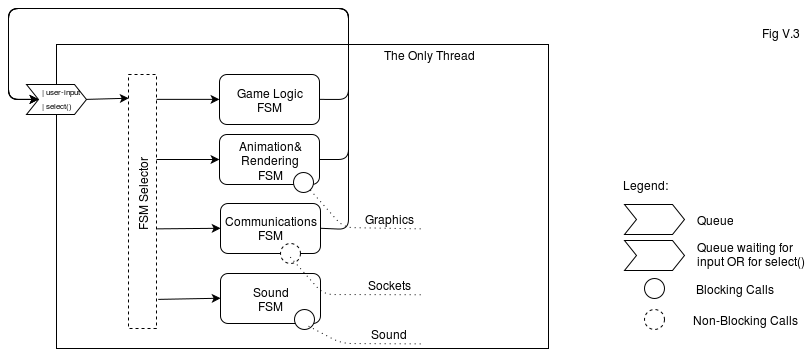

# Event-driven Finite State Machine

Event-driven finite state machine (QnFSM) game architecture implementation in JavaScript. For more information read chapter 6 in [this book](http://ithare.com/contents-of-development-and-deployment-of-massively-multiplayer-games-from-social-games-to-mmofps-with-stock-exchanges-in-between/).



## Getting Started

These instructions will get you a copy of the project up and running on your local machine for development and testing purposes.

### Prerequisites

For development the following versions were used. Proper functionality can't be guaranteed for earlier versions.

* [Git](https://git-scm.com/book/en/v2/Getting-Started-Installing-Git) >= 2.20.1
* [Node.js](https://nodejs.org/en/download/package-manager/) >= 10.18.0
* [npm](https://www.npmjs.com/get-npm) >= 6.13.7

### Installing

Clone Git repository

```
git clone https://github.com/nickyvanurk/qnfsm.git
```

Install required npm modules

```
npm install
```

Run the program

```
npm run dev
```

## Output

```
LoadState: updating
LoadState: rendering
Event added
Event added
Processing event
LoadState: loading graphics
RenderState: updating
RenderState: rendering
Processing event
PlayState: spawning player
Event added
Processing event
RenderState: creating spaceship at x: 29, y: 28, z: 28
RenderState: updating
RenderState: rendering
RenderState: updating
RenderState: rendering
...
```

## License

This project is licensed under the [MIT License](./LICENSE).
